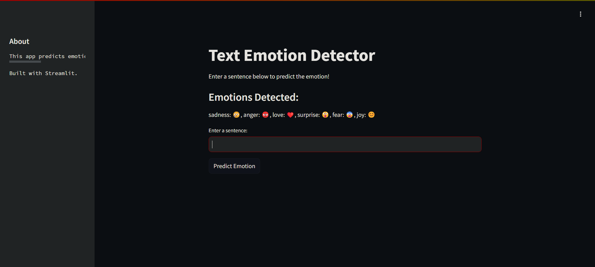
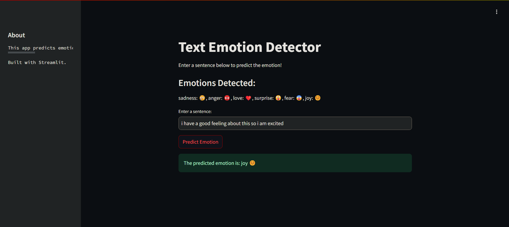

# Text Emotion Detector
This repository contains the end-to-end implementation of a Text Emotion Detector using BERT, Docker, Jenkins, Streamlit, and AWS for deployment.

## Overview
The Text Emotion Detector classifies input text into six predefined emotion categories: anger, fear, joy, love, sadness, and surprise. The project follows modern development practices, incorporating Continuous Integration/Continuous Deployment (CI/CD) pipelines and cloud deployment.

## Project Structure
Model: Built using BERT for natural language processing.

Frontend: Streamlit app providing a simple UI for users to input text and receive emotion predictions.

Deployment: Dockerized application deployed on AWS EC2.

CI/CD: Jenkins pipeline for automated testing, building, and deployment.
## Key Components
### 1. Model
Dataset: https://www.kaggle.com/datasets/praveengovi/emotions-dataset-for-nlp?select=train.txt

Training: Fine-tuned BERT model.

Saved Model: bert_emotion_model.pth.
### 2. Streamlit Application
Interface: Simple input box for users to input text.

Output: Displays the detected emotion and its probability.
### 3. Docker
Dockerfile: Contains all necessary steps to containerize the Streamlit app.

Docker Hub: The Docker image is hosted on Docker Hub at bapurolling/end-to-end.
### 4. Jenkins Pipeline
Trigger: Automatically triggered on every push to the GitHub repository.

Steps:
Pull the latest Docker image.

Stop the existing container if running.

Run a new container with the updated image.
### 5. AWS Deployment
Instance: EC2 instance in the 'Asia Pacific (Mumbai)' region.

Access: The app runs on port 8501.
## Getting Started
### Prerequisites
Docker

Jenkins

AWS account
### Steps
#### Clone the repository:
```bash
git clone https://github.com/Bapurolling/Text_Emotion_Detector.git
cd Text_Emotion_Detector
```

#### Build and Run the Docker Container:
```bash
docker build -t text_emotion_detector .
docker run -p 8501:8501 text_emotion_detector
```
### Alternate Way: Directly Pull the Docker Image from Docker Hub
You can skip the above steps and directly pull and run the pre-built Docker image from Docker Hub:

#### Pull the Docker Image

```bash
docker pull bapurolling/end-to-end:latest
```
#### Run the Docker Container

```bash

docker run -p 8501:8501 bapurolling/end-to-end:latest
```
#### Access the Application
Open your web browser and go to http://localhost:8501 to use the Text Emotion Detector.
## User Interface

Here are some screenshots of the Text Emotion Detector application:

### Main UI


### Prediction Result

#### Access the App:
Open a browser and go to http://localhost:8501 to access the Streamlit app.

## Jenkins CI/CD Pipeline
The Jenkins pipeline is configured to automatically build, test, and deploy the application on every push to the GitHub repository.

## AWS Deployment
The application is deployed on an AWS EC2 instance. Follow the steps in the Jenkins pipeline to automatically deploy the latest version of the app.
